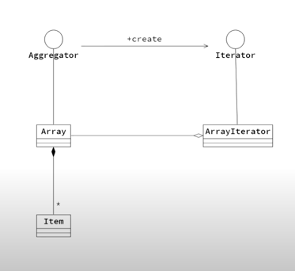

- `Iterator 패턴`
  - 컬렉션의 내부 구조를 노출하지 않고, 공통 인터페이스(Iterator)를 통해 요소를 순차적으로 접근할 수 있게 하는 패턴이다.
  - 이를 통해 배열, 트리 등 다양한 집합체를 동일한 방식으로 순회할 수 있다.
  - 인터페이스(Iterator)는 틀만 제공하고, 구체 클래스(ArrayIterator, TreeIterator 등)가 그 구조(Array, Tree 등)에 맞게 순회 방식을 만들어줘야 함.